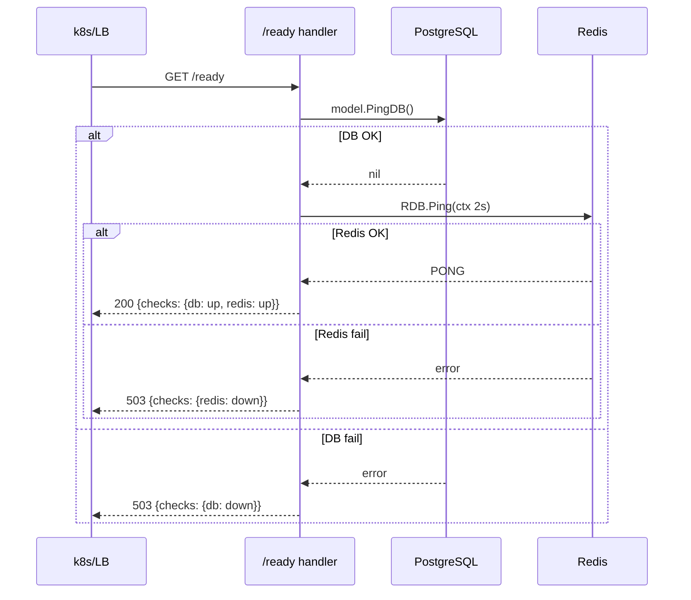

# 存活/就绪探针 (Health & Readiness Endpoints)

## 背景

new-api 原生只提供 `/api/status`（含完整前端启动配置 + DB 检查），用于 docker-compose healthcheck 与管理面板初始化。
对于 Kubernetes / 现代负载均衡器，需要符合约定的 **极简存活探针** 与 **依赖感知的就绪探针**：

- **liveness**（存活）：只要进程能响应 HTTP 就算活着。失败 → 重启容器。
- **readiness**（就绪）：DB / Redis 可用才算就绪。失败 → 摘流但不重启。

把这两个职责合并到 `/api/status` 是反模式（status 检查依赖太多组件，会导致正常的小抖动也触发重启循环）。

## 设计

### 端点

| 路径 | 类型 | 检查项 | 成功码 | 失败码 |
|---|---|---|---|---|
| `GET /health` | liveness | 仅返回进程状态 | 200 | n/a（除非进程崩溃） |
| `GET /healthz` | liveness | 同上（k8s 默认探针路径别名） | 200 | n/a |
| `GET /ready` | readiness | DB + Redis（启用时） | 200 | 503 |
| `GET /readyz` | readiness | 同上（k8s 默认探针路径别名） | 200 | 503 |

### 响应格式

**`/health` 成功**：
```json
{ "status": "ok", "version": "v0.5.x" }
```

**`/ready` 成功**：
```json
{
  "status": "ok",
  "version": "v0.5.x",
  "checks": {
    "database": { "status": "up" },
    "redis":    { "status": "up" }
  }
}
```

**`/ready` 失败**（HTTP 503）：
```json
{
  "status": "unavailable",
  "version": "v0.5.x",
  "checks": {
    "database": { "status": "down", "error": "dial tcp ..." },
    "redis":    { "status": "up" }
  }
}
```

## 核心方法

| 方法 | 文件 | 输入 | 输出 | 副作用 |
|---|---|---|---|---|
| `controller.Healthz` | `controller/healthz.go` | gin.Context | 200 + JSON | 无 |
| `controller.Readyz`  | `controller/healthz.go` | gin.Context | 200 / 503 + JSON | 调用 `model.PingDB()` 与 `common.RDB.Ping()` |
| `router.SetHealthRouter` | `router/health-router.go` | `*gin.Engine` | 注册 4 条路由 | 无 |

## 调用链

```
main.go::main
  └─> router.SetRouter
        └─> router.SetHealthRouter         ← 新增
              ├─> GET /health  → controller.Healthz
              ├─> GET /healthz → controller.Healthz
              ├─> GET /ready   → controller.Readyz
              │     ├─> model.PingDB()           (10s 内有缓存)
              │     └─> common.RDB.Ping()        (2s 超时)
              └─> GET /readyz  → controller.Readyz
```

## 流程图



## 关键设计决定

1. **路由注册位置**：在 `router.SetRouter` 最前面注册（早于 `SetApiRouter`），确保后续即便有人在 `/api` 上加了重型中间件，探针仍然可达。
2. **不挂中间件**：探针不走 `RequestId`、`I18n`、`gzip`、`auth`、`rate-limit`，纯净路径。
3. **路径别名**：同时支持 `/health` 与 `/healthz`（`/ready` 与 `/readyz`），覆盖 k8s 默认与 LB 默认两种习惯，部署侧无需改配置。
4. **不替换 `/api/status`**：原端点继续保留，docker-compose 既有 healthcheck 不受影响。
5. **Redis 检查可选**：当 `common.RedisEnabled = false`（用户没配 Redis）时跳过 Redis 检查，只校验 DB。
6. **超时**：Redis ping 2s，避免 Redis 短暂卡顿把就绪状态拖垮。

## 部署示例

### Kubernetes

```yaml
livenessProbe:
  httpGet:
    path: /healthz
    port: 3000
  initialDelaySeconds: 10
  periodSeconds: 10
readinessProbe:
  httpGet:
    path: /readyz
    port: 3000
  initialDelaySeconds: 5
  periodSeconds: 5
  failureThreshold: 3
```

### docker-compose 升级（可选，原配置仍可用）

```yaml
healthcheck:
  test: ["CMD-SHELL", "wget -q -O - http://localhost:3000/ready | grep -q '\"status\":\\s*\"ok\"' || exit 1"]
  interval: 30s
  timeout: 10s
  retries: 3
```

## 测试

- 单元测试：`controller/healthz_test.go`（覆盖 `/health` 200 + `/ready` DB-down 时 503）
- 端到端：起 docker-compose 后 `curl http://localhost:3000/health` 与 `curl -i http://localhost:3000/ready`

## 日志打点

探针端点不打 INFO 日志（避免日志噪声）。仅当依赖检查失败时由 `model.PingDB()` 自身的 ERR 日志体现。
